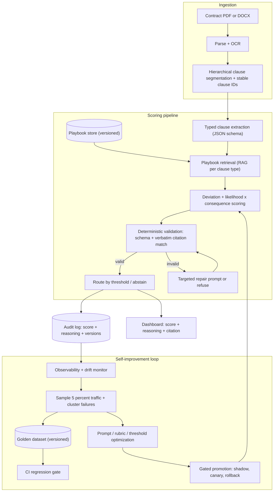

# Production-grade contract risk scoring: architecture, design, and specification

Status: design specification (not yet fully implemented). This document specifies a
production-grade methodology and system for contract-clause risk scoring, plus the
three capabilities requested on top of it: a configurable **playbook**, **reasoning shown
next to every score**, and an **automatic self-testing / self-improving** loop.

It is grounded in the current 2026 practice cited inline, and it maps each piece to this
repository's existing code (`generate_dashboard.py`, the dashboard, the test suite, CI) so
the work can be delivered incrementally and verifiably.

---

## 1. Goals and non-goals

Goals
- Score contract risk at the **clause level**, not the document level, so every score is actionable.
- Make each score **defensible and auditable**: it points to the exact clause text, the rule/threshold it breached, the model/config version, and (on override) a human rationale.
- Ground scoring in a **configurable, versioned playbook** of preferred / fallback / walk-away positions per clause type.
- Continuously **self-test** (regression gates in CI + sampled production checks) and **self-improve** (turn real failures into new test cases and prompt/rubric refinements) without silently rewriting history.
- Satisfy 2026 governance expectations (EU AI Act transparency + high-risk controls, NIST AI RMF documented human oversight).

Non-goals
- Replacing lawyers. The system triages and screens; a qualified human retains final authority on high-value or novel clauses ([harvey.ai](https://www.harvey.ai/blog/contract-management-best-practices), [justee.ai](https://justee.ai/blog/ai-contract-review-faster-accurate)).
- Fine-tuning foundation-model weights. Improvement lives in the harness (playbook, prompts, retrievers, rubrics, thresholds), consistent with the "self-improving agent = harness, not new weights" pattern ([labs.adaline.ai](https://labs.adaline.ai/p/self-improving-ai-agent-production-pattern)).

---

## 2. Requirements

### 2.1 Functional
- FR1 Segment a contract into clauses with a **stable clause ID** per clause.
- FR2 Extract structured facts per clause into a **typed schema** (no free text where a field will be scored).
- FR3 Score each clause on **likelihood x consequence** and map to bands with a required action.
- FR4 Compare each clause to the applicable **playbook** entry (preferred / fallback / walk-away) and score the deviation.
- FR5 Attach **reasoning** to every score: the clause excerpt (verbatim), the factor/threshold breached, the playbook version, the model/config version.
- FR6 **Route** by threshold (fast-lane vs escalate), with mandatory escalations that ignore the numeric score (e.g., compliance).
- FR7 **Abstain** (route to human) when confidence is low or the clause is out-of-playbook, rather than guessing.
- FR8 Persist an **audit record** for every clause score and every human override.

### 2.2 Non-functional
- NFR1 Determinism where possible: schema/regex/citation checks are code, not model calls ([futureagi.com](https://futureagi.com/blog/contract-review-rag-build-evaluate-2026/)).
- NFR2 Reproducibility: pin model version, playbook version, and dataset manifest hash on every result ([qaskills.sh](https://qaskills.sh/blog/llm-eval-golden-dataset-versioning)).
- NFR3 Observability: one trace per contract with a span per pipeline step (latency, tokens, quality, guardrail events), OpenTelemetry GenAI conventions ([devops.com](https://devops.com/what-you-cannot-see-will-break-your-llm-app-a-practitioner-guide-to-production-observability/)).
- NFR4 Safety: layered guardrails (input, retrieval, output) with self-correction on failure ([digitalapplied.com](https://www.digitalapplied.com/blog/llm-guardrails-production-safety-layers-reference-2026), [arthur.ai](https://www.arthur.ai/column/what-to-look-for-ai-observability-platform-2026)).
- NFR5 Security: the dashboard already escapes untrusted contract text and ships a strict CSP; the pipeline must keep contract text out of any executable context.

---

## 3. Target architecture



The current repository implements the right-hand consumer of this pipeline: `generate_dashboard.py`
turns the pipeline's structured output into the dashboard, and the notebooks contain the
RAG extraction/assessment stages. This spec formalizes the scoring core and adds the playbook,
reasoning, and self-improvement layers.

---

## 4. Data model (typed contracts)

Every scored field carries a source span so it can be verified against the contract text
([pastagi.com](https://pastagi.com/engineering/stop-rag-hallucination-typed-schemas/),
[collinwilkins.com](https://collinwilkins.com/articles/structured-output)).

Clause record
```json
{
  "clauseId": "KC-004",
  "clauseType": "Indemnification",
  "section": "Section 8.3",
  "extractedClause": "verbatim clause text",
  "sourceSpan": {"page": 8, "start": 1423, "end": 1710},
  "summary": "…"
}
```

Score record (the "reasoning next to the score")
```json
{
  "clauseId": "KC-004",
  "factor": "indemnification_scope",
  "riskLevel": "High",
  "likelihood": "Possible",
  "score": 8,
  "band": "Escalate",
  "playbookRef": {"id": "indemnification", "version": "2026-08-01", "position": "walk-away"},
  "rationale": "Indemnity is one-directional and omits IP carve-out; playbook requires mutual + capped.",
  "citations": [{"clauseId": "KC-004", "quote": "Provider shall indemnify…", "verified": true}],
  "confidence": 0.86,
  "modelVersion": "scorer-2026-08-19",
  "reviewer": null,
  "override": null
}
```

Playbook entry (configurable)
```json
{
  "id": "limitation_of_liability",
  "appliesTo": ["MSA", "SaaS"],
  "preferred": "Cap at 12 months fees; super-cap 3x for IP/data; exclude indirect damages.",
  "fallback": "Cap up to 24 months fees above $250K ACV; super-cap 2x for data.",
  "walkAway": "Cap below 12 months fees; uncapped indirect damages; data liability folded into general cap.",
  "likelihoodGuidance": "Frequency of deviation vs. this position (1-5).",
  "impactGuidance": "Exposure vs. deal value / coverage (1-5).",
  "mandatoryEscalation": false,
  "version": "2026-08-01"
}
```

Rationale for these shapes: clause-level scoring with named factors and required citations is the
2026 consensus ([trydock.ai](https://trydock.ai/blog/ai-risk-scoring)); three positions per clause
(preferred/fallback/walk-away) is the standard playbook structure
([ironcladapp.com](https://ironcladapp.com/resources/articles/modern-contract-playbook),
[vaquill.ai](https://www.vaquill.ai/blog/in-house-contract-review-playbook-2026)).

---

## 5. Scoring methodology (ISO 31000 aligned)

- Score `likelihood x consequence` on a documented matrix; keep bands and their required action explicit and auditable ([riskpublishing.com](https://riskpublishing.com/contract-risk-assessment-checklist/), [sirion.ai](https://www.sirion.ai/library/contract-insights/contract-risk-prioritization-frameworks/)). This repo already encodes a 3x3 `RISK_MATRIX` in `generate_dashboard.py`; the production target is a documented 5x5 with per-contract-type calibration.
- Distinguish **inherent** vs **residual** risk (before/after existing controls such as insurance or standard clauses) ([riskpublishing.com](https://riskpublishing.com/contract-risk-assessment-checklist/)).
- Compute a **severity-weighted portfolio/contract index** (worst-case emphasis) in addition to the per-clause scores, so a few catastrophic clauses are not diluted — already added to this repo as `compute_weighted_risk_score` and the "Top Priority Risks" callout.
- Bands drive one action each: accept / negotiate (to fallback) / escalate / walk-away ([vaquill.ai](https://www.vaquill.ai/blog/contract-risk-assessment-framework)).
- Weight factors by business importance before aggregating to a 0-100 contract score, with configurable thresholds per contract type ([clearcontract.dk](https://www.clearcontract.dk/ai-contract-risk-scoring-model), [intelagree.com](https://www.intelagree.com/blog/getting-ai-contract-review-right-tailor-test-trust)).

---

## 6. Configurable playbook

- Store playbook entries as **versioned data** (a `playbooks/*.json` or DB table), one set per contract type (MSA, NDA, DPA, SaaS, …) ([vaquill.ai](https://www.vaquill.ai/blog/in-house-contract-review-playbook-2026)).
- At scoring time, **retrieve** the applicable entry per clause type (RAG grounded in the firm's private playbook, not a generic template) so flags reflect your standard ([sirion.ai](https://www.sirion.ai/library/contract-insights/contract-risk-prioritization-frameworks/), [ziasign.com](https://ziasign.com/blogs/how-to-automatically-flag-risky-clauses-using-ai-contract-analysis)).
- The score is the **deviation** from the retrieved position; the matched position (preferred/fallback/walk-away) and playbook version are recorded on the score record (see Section 4).
- `mandatoryEscalation` on an entry forces routing to human regardless of numeric score ([sirion.ai](https://www.sirion.ai/library/contract-insights/contract-risk-prioritization-frameworks/)).
- Review/recalibrate the playbook quarterly or after material regulatory/commercial events ([sirion.ai](https://www.sirion.ai/library/contract-insights/contract-risk-prioritization-frameworks/)).

Where this can start today (CPU-only): the deterministic scorer in `generate_dashboard.py` can load a
`playbooks/<type>.json`, match by `clauseType`, and record `playbookRef` + `band` on each risk — no LLM required.

---

## 7. Reasoning shown next to every score

- Force the generator into a **typed schema** where each claim carries a `clauseId` and a verbatim `quote`; use native structured-output/JSON-schema modes and validate with Pydantic ([collinwilkins.com](https://collinwilkins.com/articles/structured-output), [pastagi.com](https://pastagi.com/engineering/stop-rag-hallucination-typed-schemas/)).
- **Deterministically validate every citation before it leaves the system**: the cited clause ID must exist and the quoted span must match the contract text verbatim (small Levenshtein tolerance for OCR/whitespace). Failed validation triggers a targeted repair prompt or refusal — never a hand-back of an invalid answer ([futureagi.com](https://futureagi.com/blog/contract-review-rag-build-evaluate-2026/), [txsln.com](https://www.txsln.com/case-studies/z3e1r5u3fm9s746/)).
- In the dashboard, render the rationale + the clickable clause excerpt next to each score ("click-to-source"), which is what makes reviewers trust it and what survives audit ([intelagree.com](https://www.intelagree.com/blog/getting-ai-contract-review-right-tailor-test-trust), [trydock.ai](https://trydock.ai/blog/ai-risk-scoring)).

Where this can start today: the dashboard already stores `potentialConsequence` and `clauseReference`
per risk; extend the risk record with `rationale` + `citations` and show them in the clause card and the
Top Priority Risks callout.

---

## 8. Self-testing (regression + calibration)

A production evals suite has four parts ([bigdataboutique.com](https://bigdataboutique.com/blog/llm-evaluation-frameworks-metrics-best-practices), [metacto.com](https://www.metacto.com/blogs/llm-evals-regression-suite-production)):
1. **Golden dataset**: 100-500 curated, versioned, stratified examples (typical, edge, adversarial); hidden holdout separate from dev set ([prodinit.com](https://prodinit.com/blog/llm-evals), [qaskills.sh](https://qaskills.sh/blog/llm-eval-golden-dataset-versioning)).
2. **Layered scorers**:
   - Deterministic floors (no LLM): schema compliance, citation validity, PII-redaction on logs — these must be near-100% ([futureagi.com](https://futureagi.com/blog/contract-review-rag-build-evaluate-2026/)).
   - LLM-as-judge for semantic quality (groundedness, completeness vs a lawyer-graded key, out-of-scope refusal), decomposed into 3-5 binary rubrics, position-swapped to cancel bias ([bigdataboutique.com](https://bigdataboutique.com/blog/llm-evaluation-frameworks-metrics-best-practices)).
   - Risk-flag **precision/recall** against a senior-lawyer-labeled set ([futureagi.com](https://futureagi.com/blog/contract-review-rag-build-evaluate-2026/)).
3. **CI gate**: every PR touching a prompt, model, retriever, schema, or scorer runs the golden set and blocks merge on regression beyond a per-metric threshold ([metacto.com](https://www.metacto.com/blogs/llm-evals-regression-suite-production)).
4. **Judge calibration**: before trusting the LLM judge, validate against 50-100 human-labeled examples (target agreement / Cohen's kappa >= 0.6, or >=75% on your rubric) and re-calibrate each release ([prodinit.com](https://prodinit.com/blog/llm-evals)).

Aim for 100% catch on deal-breakers and 90%+ on negotiables; false negatives are the dangerous mode
([zarifautomates.com](https://www.zarifautomates.com/blog/how-to-build-an-ai-contract-review-workflow)).

Where this exists / can start today: this repo already has a pytest suite (79 tests, ~95% coverage) and a
CI gate. The next step is a `golden/` dataset of `state -> expected structured output` cases plus a runner
that fails CI on regression — deterministic, CPU-only, no model needed for the deterministic floors.

---

## 9. Self-improving loop

A self-improving system is a **harness** that ingests its own production traces, scores them, surfaces
failure patterns, generates targeted improvements, and ships them back under gated promotion
([labs.adaline.ai](https://labs.adaline.ai/p/self-improving-ai-agent-production-pattern),
[arxiv LinkedIn](https://arxiv.org/html/2608.10224v1)).

1. **Capture** every production interaction with its trace and structured output.
2. **Sample** 5-10% of traffic and score it with the same evaluators used in CI; **monitor drift** in the judge-score distribution and the low-confidence tail ([devops.com](https://devops.com/what-you-cannot-see-will-break-your-llm-app-a-practitioner-guide-to-production-observability/), [bigdataboutique.com](https://bigdataboutique.com/blog/llm-evaluation-frameworks-metrics-best-practices)).
3. **Cluster failures** and **auto-promote** novel failure clusters into the golden dataset (as a new, reviewable dataset revision) so the next release is tested against today's bugs ([bigdataboutique.com](https://bigdataboutique.com/blog/llm-evaluation-frameworks-metrics-best-practices), [qaskills.sh](https://qaskills.sh/blog/llm-eval-golden-dataset-versioning)).
4. **Optimize** the scaffold (prompts, rubrics, retrieval config, thresholds) via reflective prompt evolution / tree search over candidate edits, scored against the fixed dataset+rubric ([arxiv LinkedIn](https://arxiv.org/html/2608.10224v1), [ALP paper](https://ai-discovery-in-the-wild.github.io/papers/FacdVNCMRV.pdf), [emergentmind GEPA](https://api.emergentmind.com/papers/2606.08867)).
5. **Promote safely**: shadow -> canary -> full, with rollback; treat prompts/rubrics/thresholds as versioned artifacts because they behave like policy changes ([arxiv LinkedIn](https://arxiv.org/html/2608.10224v1)).
6. **Human-in-the-loop repair** for what the automation cannot fix: a "hint + replay + re-score" pattern, with expert annotation on residual failures against the same rubric that calibrates the judge ([shopify.engineering](https://shopify.engineering/sidekicks-continual-learning-loop)).

Guardrail against gaming metrics: never mutate a failing eval run after the fact; create a new dataset
revision and use a "bridge" run (same system on both revisions) so a corrected bad gold is not celebrated
as a model gain ([qaskills.sh](https://qaskills.sh/blog/llm-eval-golden-dataset-versioning)).

---

## 10. Reliability: guardrails, confidence, abstention, observability

- **Layered guardrails**: pre-LLM (input validation, PII redaction, prompt-injection detection), retrieval (filter poisoned/irrelevant chunks), output (schema + citation + toxicity), each independently observable; failed output guardrails feed a self-correction retry ([digitalapplied.com](https://www.digitalapplied.com/blog/llm-guardrails-production-safety-layers-reference-2026), [arthur.ai](https://www.arthur.ai/column/what-to-look-for-ai-observability-platform-2026)).
- **Confidence + abstention**: calibrate confidence against a held-out set (e.g., conformal prediction) and abstain to human review when uncertainty exceeds the risk budget or the clause is out-of-playbook ([arthur.ai](https://www.arthur.ai/column/what-to-look-for-ai-observability-platform-2026)).
- **Observability**: one trace per contract, span per step with latency/token/quality/guardrail attributes; two-tier evals (cheap deterministic checks on every request, model-graded on a 5% sample) with trend alerts before users complain ([devops.com](https://devops.com/what-you-cannot-see-will-break-your-llm-app-a-practitioner-guide-to-production-observability/)).

---

## 11. Governance and compliance mapping (2026)

- **EU AI Act**: transparency obligations (Article 50) are in force as of 2 August 2026; high-risk-system obligations (which include AI used in the administration of justice) apply from 2 December 2027 and require risk management, data quality, activity logging/traceability, technical documentation, human oversight, and explainability ([goodwinlaw.com](https://www.goodwinlaw.com/en/insights/publications/2026/08/alerts-technology-dpc-eu-ai-act-transparency-obligations-now-in-force), [digital-strategy.ec.europa.eu](https://digital-strategy.ec.europa.eu/en/policies/regulatory-framework-ai), [goteleport.com](https://goteleport.com/blog/eu-ai-act-requirements/)). The audit record (Section 4), logging (Section 10), and human oversight (Sections 7-9) are designed to satisfy these.
- **NIST AI RMF**: documented human oversight of overrides is the single most cited habit for surviving audit ([trydock.ai](https://trydock.ai/blog/ai-risk-scoring)).

---

## 12. Phased implementation roadmap (mapped to this repo)

Doable now, CPU-only, no model at runtime:
- P-A **Configurable playbook (deterministic)**: add `playbooks/<contractType>.json`; load in `generate_dashboard.py`; match by `clauseType`; record `playbookRef` + `band` + `mandatoryEscalation` on each risk; unit-test with pytest.
- P-B **Reasoning next to score**: extend the risk record with `rationale` + `citations`; render them in the clause cards and the Top Priority Risks callout; add a deterministic citation-validity check (quoted span exists in the clause text) with tests.
- P-C **Golden-dataset regression harness**: add `golden/*.json` (`state -> expected structured output`), a runner, and a CI job that fails on regression of the deterministic floors (schema validity, citation validity, band correctness). Extends the existing CI added in the quality/CI phase.

Requires model/LLM infrastructure (not runnable on this CPU VM; specify + build behind a flag):
- P-D **Typed LLM extraction + playbook-RAG scoring** with structured outputs and deterministic citation validation.
- P-E **LLM-as-judge evals** with calibration, plus the 5% production sampling + drift monitor.
- P-F **Self-improving loop**: failure clustering, auto-promotion to the golden set, reflective prompt/rubric optimization, gated promotion.

---

## 13. Open decisions

- Model/provider and hosting for P-D-F (data-governance constraints for contract text).
- Playbook storage: repo JSON (versioned with code) vs. a database/CLM integration.
- Coverage/precision/recall targets and escalation thresholds per contract type (needs legal input and a labeled set).
- Whether the deterministic scorer and the LLM scorer run in parallel (deterministic as a floor/guardrail on the LLM) — recommended.
